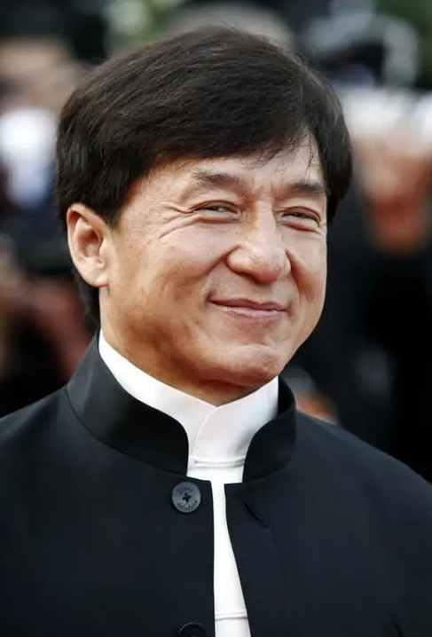

# PortraitMatting (Demo)

**Note**: This application is not allowed for commercial use.

<table border="0">
  <tr>
    <th>Image</th>
    <th>Matte</th>
    <th>Composition</th>
  </tr>
  <tr>
    <td></td>
    <td></td>
    <td></td>
  </tr>
</table>


## Model
1. Download model from the [Google Drive](https://drive.google.com/file/d/1_F3UV1I1tdp_No9RxH30rAudowHeY2Et/view?usp=sharing).
2. Put the model file in the `ckpt` folder. Do not rename the model file.

## Requirements
Install packages from requirements file.
```python
pip install -r requirements.txt
```

## Demo
Just run `demo.py`.
```python
python demo.py
```
If you don't have a GPU, you need to change `Matting(gpu=True)` in the `demo.py` to `Matting(gpu=False)` first.
